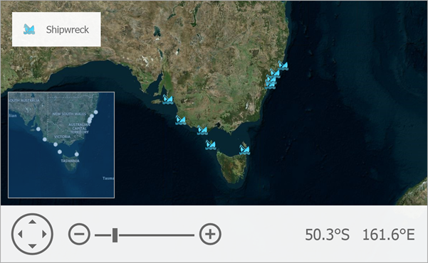

<!-- default badges list -->

<!-- default badges end -->

# Map for WinForms - How to Create Map Items Based on Data From an XML File

This example displays ship icons ([map custom items](https://docs.devexpress.com/WindowsForms/DevExpress.XtraMap.MapCustomElement?p=netframework)) that depict shipwrecks. The Map Control uses the [`ListSourceDataAdapter`](https://docs.devexpress.com/WindowsForms/DevExpress.XtraMap.ListSourceDataAdapter?p=netframework) assigned to a [vector layer](https://docs.devexpress.com/WindowsForms/DevExpress.XtraMap.VectorItemsLayer?p=netframework) to load the shipwreck locations from an XML file.

The example also shows how to add a [mini map](https://docs.devexpress.com/WindowsForms/17683/controls-and-libraries/map-control/visual-elements/mini-map?p=netframework) to navigate the map. 

To show a legend, add a [`ColorListLegend`](https://docs.devexpress.com/WindowsForms/DevExpress.XtraMap.ColorListLegend) with [custom items](https://docs.devexpress.com/WindowsForms/DevExpress.XtraMap.ColorListLegend.CustomItems).

> **NOTE:** You can handle the vector item's [`DataLoaded`](https://docs.devexpress.com/WindowsForms/DevExpress.XtraMap.LayerBase.DataLoaded) event to access created map items in the event arguments.

## Files to Look At

* [Form1.cs](./CS/WinForms_MapControl_ListAdapter/Form1.cs) (VB: [Form1.vb](./VB/WinForms_MapControl_ListAdapter/Form1.vb))

## Documentation

* [How to: Automatically Generate Vector Items from a Data Source](https://docs.devexpress.com/WindowsForms/15220/controls-and-libraries/map-control/examples/vector-data/providing-data/how-to-automatically-generate-vector-items-from-a-datasource)
* [Vector Items](https://docs.devexpress.com/WindowsForms/15091/controls-and-libraries/map-control/vector-data/vector-items?p=netframework)

## More Examples

* [How to load data from a KML file](https://github.com/DevExpress-Examples/how-to-load-data-from-a-kml-file-t140303)
* [How to load SVG file content to the Map Control](https://github.com/DevExpress-Examples/how-to-load-svg-file-content-to-the-map-control-t312482)
* [How to load data from a SQL geometry data-source](https://github.com/DevExpress-Examples/how-to-load-data-from-a-sql-geometry-data-source-t175898)
* [How to customize mini map layers](https://github.com/DevExpress-Examples/how-to-customize-mini-map-layers-t201418)
<!-- feedback -->
## Does this example address your development requirements/objectives?

 

(you will be redirected to DevExpress.com to submit your response)
<!-- feedback end -->
